   #### frocks.html

   ---------------
    <!doctype html>
<html lang="en">
  <head>
    <!-- Required meta tags -->
    <meta charset="utf-8">
    <meta name="viewport" content="width=device-width, initial-scale=1">

    <!-- Bootstrap CSS -->
    <link href="https://cdn.jsdelivr.net/npm/bootstrap@5.1.3/dist/css/bootstrap.min.css" rel="stylesheet" integrity="sha384-1BmE4kWBq78iYhFldvKuhfTAU6auU8tT94WrHftjDbrCEXSU1oBoqyl2QvZ6jIW3" crossorigin="anonymous">

    <title>Hello, world!</title>
  </head>
  
    

        

            

              

                

                
                

                

                  <h5 class="card-title">Card title</h5>
                  
Some quick example text to build on the card title and make up the bulk of the card's content.

                  <a href="#" class="btn btn-primary">Go somewhere</a>
                

              

            

            

              

                

                
                

                

                  <h5 class="card-title">Card title</h5>
                  
Some quick example text to build on the card title and make up the bulk of the card's content.

                  <a href="#" class="btn btn-primary">Go somewhere</a>
                

              

            

            

              

                

                
                

                

                  <h5 class="card-title">Card title</h5>
                  
Some quick example text to build on the card title and make up the bulk of the card's content.

                  <a href="#" class="btn btn-primary">Go somewhere</a>
                

              

            

            

              

                

                
                

                

                  <h5 class="card-title">Card title</h5>
                  
Some quick example text to build on the card title and make up the bulk of the card's content.

                  <a href="#" class="btn btn-primary">Go somewhere</a>
                

              

            

             
            

              

                

                
                

                

                  <h5 class="card-title">Card title</h5>
                  
Some quick example text to build on the card title and make up the bulk of the card's content.

                  <a href="#" class="btn btn-primary">Go somewhere</a>
                

              

            

        

    

    <body>
       
          
    </body>
    </html>

    -------------

  #### tailor.html
  --------

    <!DOCTYPE html>
<html lang="en">
<head>
    <meta charset="UTF-8">
    <meta name="viewport" content="width=device-width, initial-scale=1.0">
    <link rel="stylesheet" href="https://cdnjs.cloudflare.com/ajax/libs/font-awesome/6.4.2/css/all.min.css" integrity="sha512-z3gLpd7yknf1YoNbCzqRKc4qyor8gaKU1qmn+CShxbuBusANI9QpRohGBreCFkKxLhei6S9CQXFEbbKuqLg0DA==" crossorigin="anonymous" referrerpolicy="no-referrer" />
    <link rel="icon" href="./favicon (1).ico">
    <link href="https://cdn.jsdelivr.net/npm/bootstrap@5.1.3/dist/css/bootstrap.min.css" rel="stylesheet" integrity="sha384-1BmE4kWBq78iYhFldvKuhfTAU6auU8tT94WrHftjDbrCEXSU1oBoqyl2QvZ6jIW3" crossorigin="anonymous">
    <link href="https://fonts.googleapis.com/css2?family=EB+Garamond:ital@1&family=Edu+TAS+Beginner:wght@400;500&display=swap" rel="stylesheet">
    <link rel="stylesheet" href="https://cdnjs.cloudflare.com/ajax/libs/font-awesome/6.4.2/css/all.min.css" integrity="sha512-z3gLpd7yknf1YoNbCzqRKc4qyor8gaKU1qmn+CShxbuBusANI9QpRohGBreCFkKxLhei6S9CQXFEbbKuqLg0DA==" crossorigin="anonymous" referrerpolicy="no-referrer" />
    <title>TAILOR</title>
</head>

<body>
   

    <header>

    <nav class="navbar">
        <nav class="navbar navbar-expand-lg navbar-light">
          

            <a class="navbar-brand" href="#">OnlineTailor</a>
          
            
            <form class="d-flex">
              

                
                <input type="text" class="form-control" placeholder="Search">
                

                <button  class="navbar-toggler" type="button" data-bs-toggle="collapse" data-bs-target="#navbarTogglerDemo02" aria-controls="navbarTogglerDemo02" aria-expanded="false" aria-label="Toggle navigation">
                  
                </button>
            </form>
            

              <ul class="navbar-nav me-auto mb-2 mb-lg-0">
                <li class="nav-item">
                  <a class="nav-link active" aria-current="page" href="#">Home</a>
                </li>
                <li class="nav-item">
                  <a class="nav-link active" aria-current="page" href="#">About Us</a>
                </li>

                <li class="nav-item">
                  

                    Designs
                    

                    
Women

                    
Baby Girls

                    
Women

                    

                  

                <li class="nav-item">
                  <a class="nav-link active" aria-current="page" href="#">Contact Us</a>
                </li>
                <li class="usericon">
                  
<i class="fa-solid fa-user" ></i>Hello,sign in

                </li>
                <li class="usericon">
                  
<i class="fa-solid fa-cart-shopping"></i>cart

                  </li>
              </ul>
              
            

          

        </nav>
      
    </header>

    
        

            

              <button type="button" data-bs-target="#carouselExampleCaptions" data-bs-slide-to="0" class="active" aria-current="true" aria-label="Slide 1"></button>
              <button type="button" data-bs-target="#carouselExampleCaptions" data-bs-slide-to="1" aria-label="Slide 2"></button>
              <button type="button" data-bs-target="#carouselExampleCaptions" data-bs-slide-to="2" aria-label="Slide 3"></button>
            

            

              

                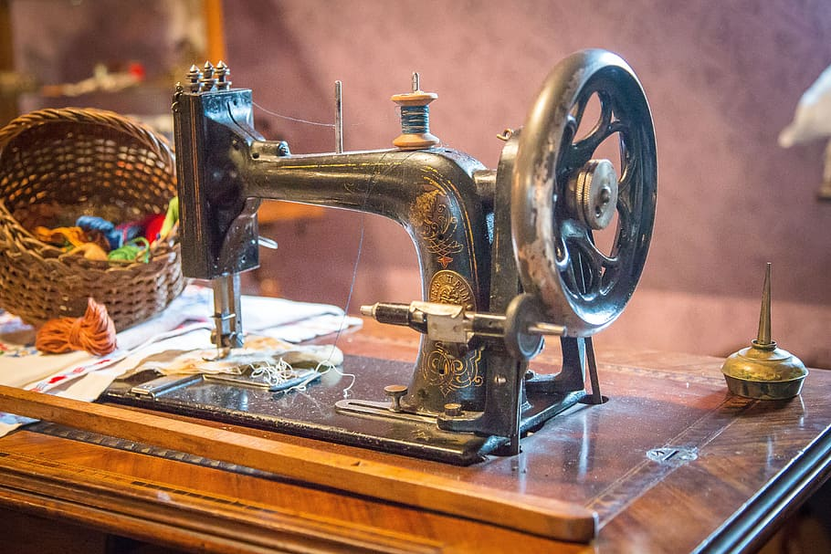
                

                 
                  
A great tailor is like a great personal trainer - they tailor that suit to your natural physique.

                

              

              

                
                

                  
                  
If youre wearing suits and you want to create your own sense of style, get to the tailor.

                

              

              
              

                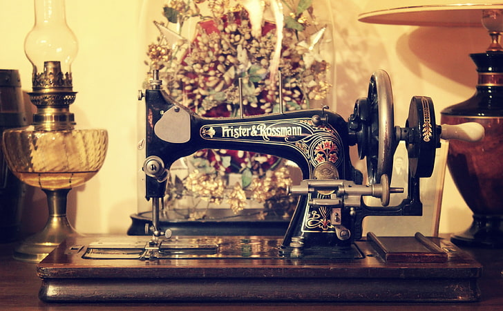
                

                  
                  
Just because a suit fits, doesn't mean it looks good. You need a tailor. You want to get bespoke.

                

              

            

            <button class="carousel-control-prev" type="button" data-bs-target="#carouselExampleCaptions" data-bs-slide="prev">
              
              Previous
            </button>
            <button class="carousel-control-next" type="button" data-bs-target="#carouselExampleCaptions" data-bs-slide="next">
              
              Next
            </button>
          

       

       

        

          

            

          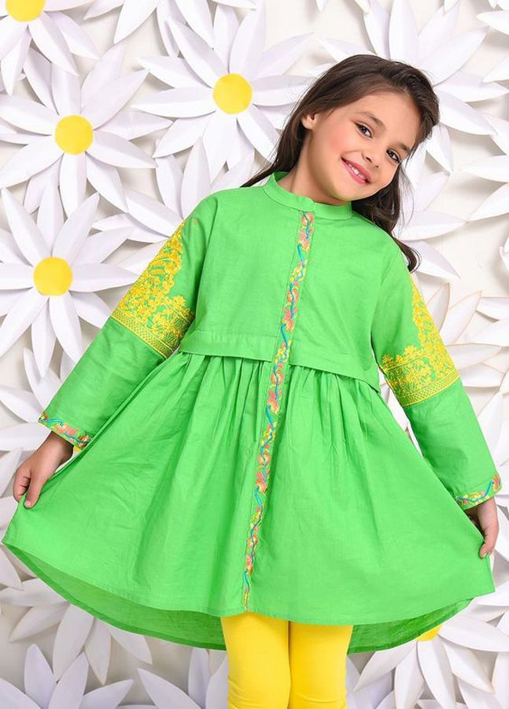
          

          

            <h5 class="card-title">Card title</h5>
            <a href="#" class="btn btn-primary">Go somewhere</a>
          

        

      
        

          

          
        

          

            <h5 class="card-title">Card title</h5>
            
            <a href="#" class="btn btn-primary">Go somewhere</a>
          

        

        

          

          
          

          

            <h5 class="card-title">Card title</h5>
            
            <a href="#" class="btn btn-primary">Go somewhere</a>
          

        

        

          

          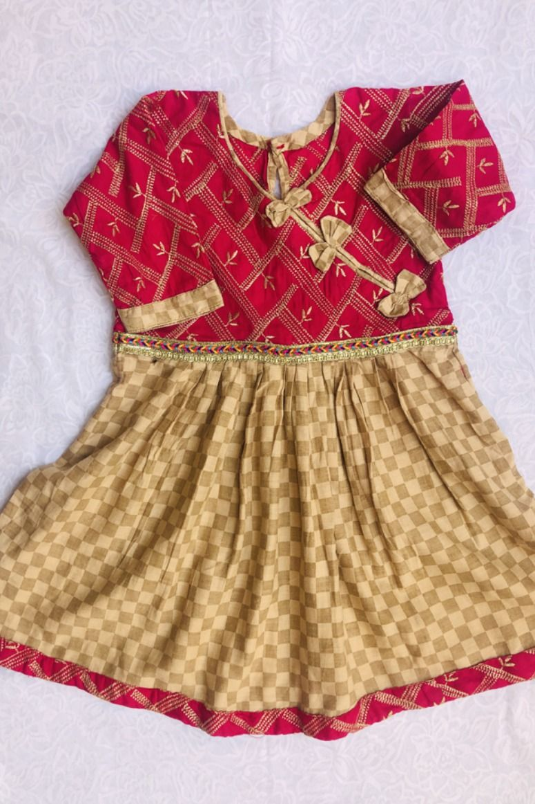
          

          

            <h5 class="card-title">Card title</h5>
            <a href="#" class="btn btn-primary">Go somewhere</a>
          

        

        

          

          
          

          

            <h5 class="card-title">Card title</h5>
            
            <a href="#" class="btn btn-primary">Go somewhere</a>
          

        

        

          

          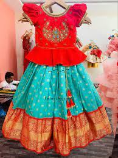
          

          

            <h5 class="card-title">Card title</h5>
            
            <a href="#" class="btn btn-primary">Go somewhere</a>
          

        

        

          

          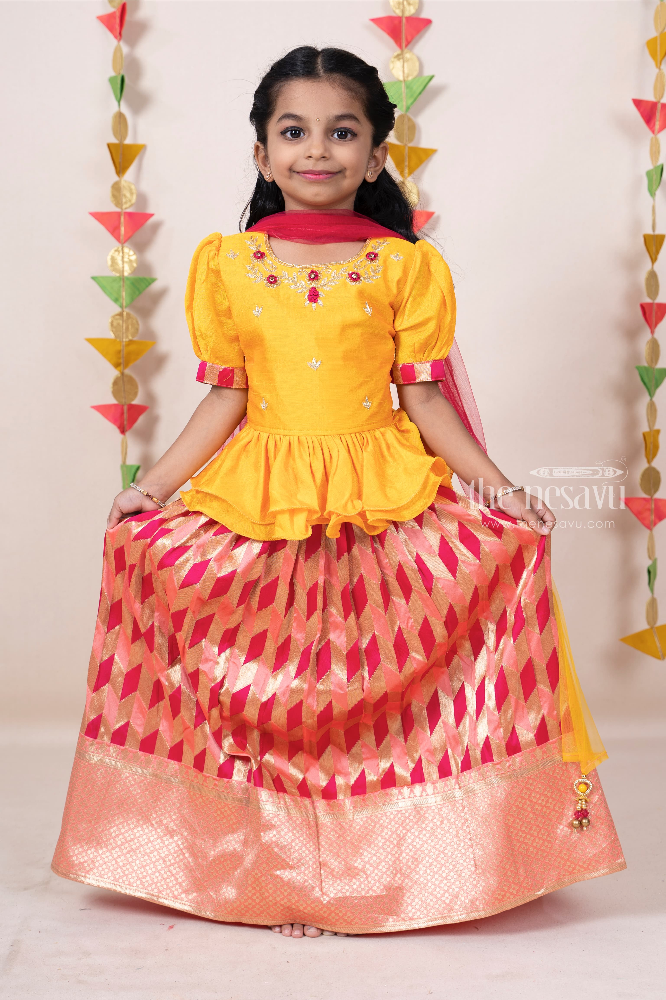
          

          

            <h5 class="card-title">Card title</h5>
            
            <a href="#" class="btn btn-primary">Go somewhere</a>
          

        

        

          

          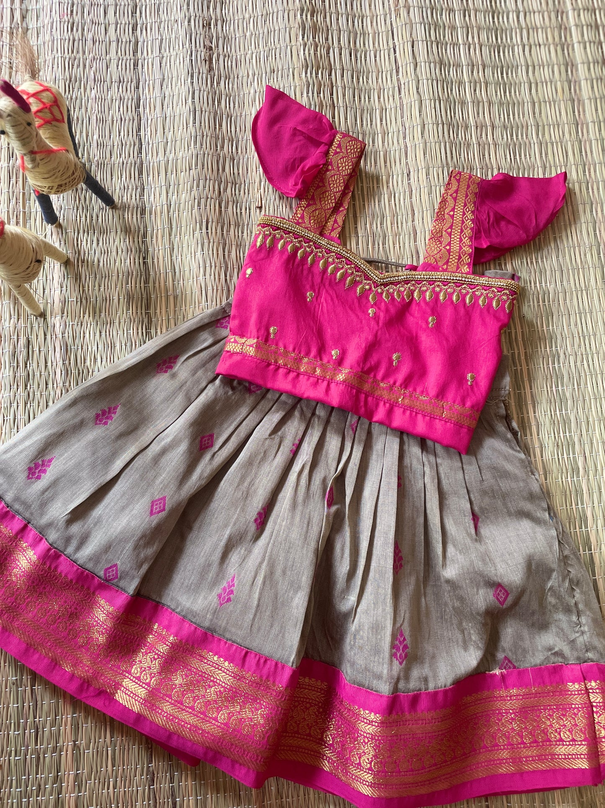
          

          

            <h5 class="card-title">Card title</h5>
            
            <a href="#" class="btn btn-primary">Go somewhere</a>
          

        

        

          

          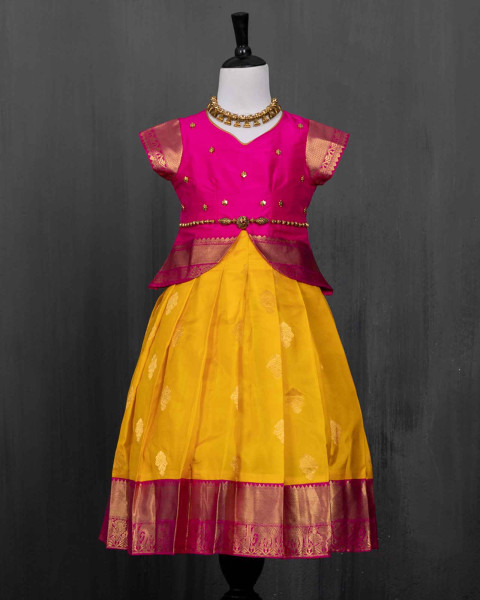
          

          

            <h5 class="card-title">Card title</h5>
            
            <a href="#" class="btn btn-primary">Go somewhere</a>
          

        

        

          

          
          

          

            <h5 class="card-title">Card title</h5>
            
            <a href="#" class="btn btn-primary">Go somewhere</a>
          

        

      

    

    

      

        

        

          
        
       
        

          <h5 class="card-title">Card title</h5>
          <a href="#" class="btn btn-primary">Go somewhere</a>
        

      

    

      

        

        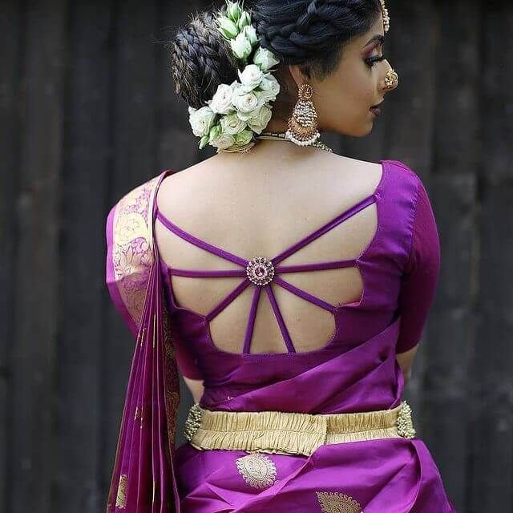
        

        

          <h5 class="card-title">Card title</h5>
          
          <a href="#" class="btn btn-primary">Go somewhere</a>
        

      

      

        

        
        

        

          <h5 class="card-title">Card title</h5>
          
          <a href="#" class="btn btn-primary">Go somewhere</a>
        

      

      

        

        
        

        

          <h5 class="card-title">Card title</h5>
          
          <a href="#" class="btn btn-primary">Go somewhere</a>
        

      

      

        

        
        

        

          <h5 class="card-title">Card title</h5>
          <a href="#" class="btn btn-primary">Go somewhere</a>
        

      

      

        

        
        

        

          <h5 class="card-title">Card title</h5>
          
          <a href="#" class="btn btn-primary">Go somewhere</a>
        

      

      

        

        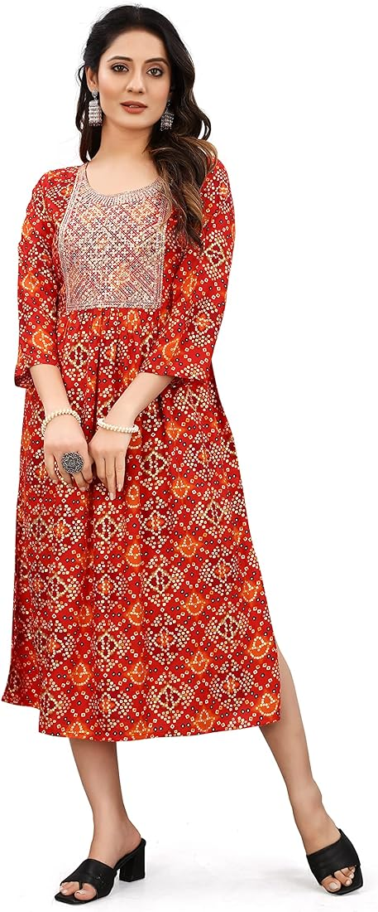
        

        

          <h5 class="card-title">Card title</h5>
          
          <a href="#" class="btn btn-primary">Go somewhere</a>
        

      

      

        

        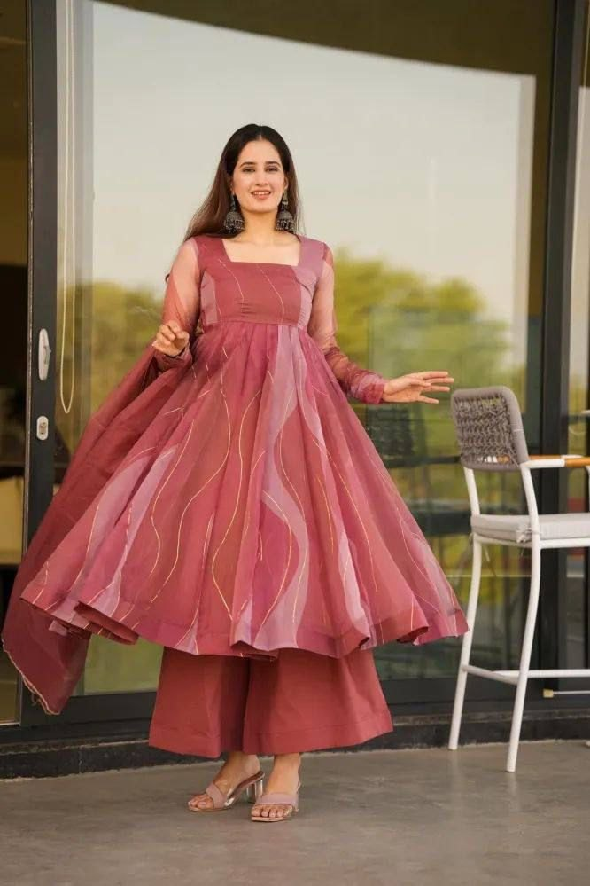
        

        

          <h5 class="card-title">Card title</h5>
          
          <a href="#" class="btn btn-primary">Go somewhere</a>
        

      

      

        

        
        

        

          <h5 class="card-title">Card title</h5>
          
          <a href="#" class="btn btn-primary">Go somewhere</a>
        

      

      

        

        
        

        

          <h5 class="card-title">Card title</h5>
          
          <a href="#" class="btn btn-primary">Go somewhere</a>
        

      

      

        

        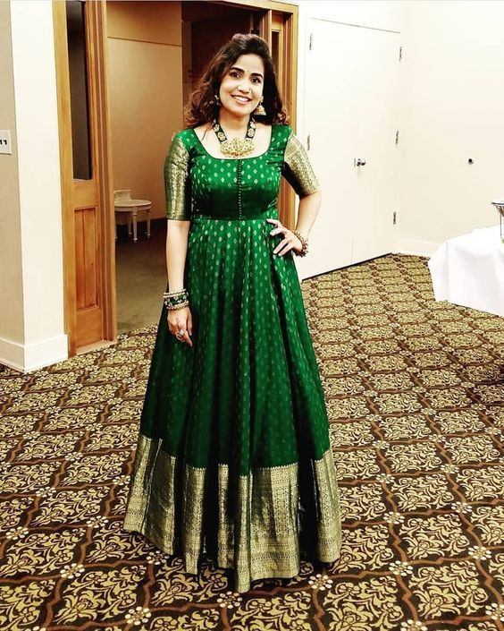
        

        

          <h5 class="card-title">Card title</h5>
          
          <a href="#" class="btn btn-primary">Go somewhere</a>
        

      

      

        

        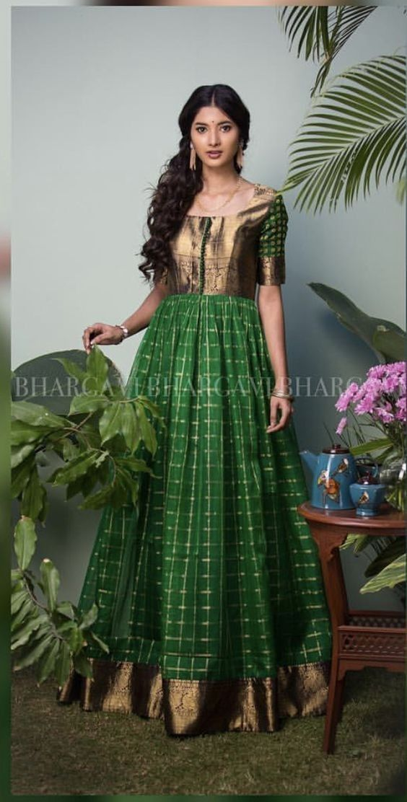
        

        

          <h5 class="card-title">Card title</h5>
          
          <a href="#" class="btn btn-primary">Go somewhere</a>
        

      

    

  

  

    

     
      

        

      
    

      

        <h5 class="card-title">Card title</h5>
        <a href="#" class="btn btn-primary">Go somewhere</a>
      

    

  
    

      

      
      

      

        <h5 class="card-title">Card title</h5>
        
        <a href="#" class="btn btn-primary">Go somewhere</a>
      

    

    

      

      
      

      

        <h5 class="card-title">Card title</h5>
        
        <a href="#" class="btn btn-primary">Go somewhere</a>
      

    

    

      

      
      

      

        <h5 class="card-title">Card title</h5>
        
        <a href="#" class="btn btn-primary">Go somewhere</a>
      

    

    

      

      
      

      

        <h5 class="card-title">Card title</h5>
        <a href="#" class="btn btn-primary">Go somewhere</a>
      

    

    

      

      
      

      

        <h5 class="card-title">Card title</h5>
        
        <a href="#" class="btn btn-primary">Go somewhere</a>
      

    

    

      

      
      

      

        <h5 class="card-title">Card title</h5>
        
        <a href="#" class="btn btn-primary">Go somewhere</a>
      

    

    

      

      
      

      

        <h5 class="card-title">Card title</h5>
        
        <a href="#" class="btn btn-primary">Go somewhere</a>
      

    

    

      

      
      

      

        <h5 class="card-title">Card title</h5>
        
        <a href="#" class="btn btn-primary">Go somewhere</a>
      

    

    

    

      
      

        <h5 class="card-title">Card title</h5> 
        <a href="#" class="btn btn-primary">Go somewhere</a>
      

    

  

    

      

      
      

      

        <h5 class="card-title">Card title</h5>
        
        <a href="#" class="btn btn-primary">Go somewhere</a>
      

    

  

   
     
    
  

   
  
</body>
</html>